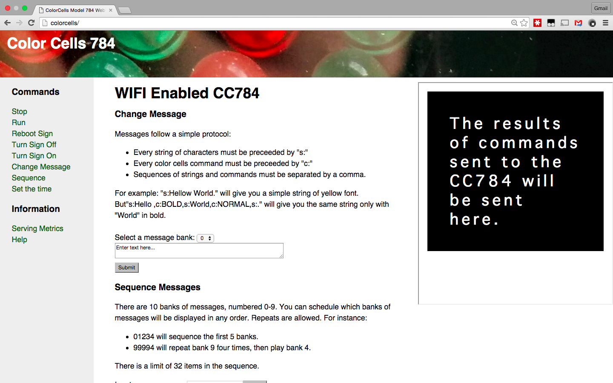

# CC784Arduino
This is the code behind my wifi-enabled ColorCells CC784 LED message board. It uses an ESP8266 and Arduino libraries to build a web front-end and REST-like API for this old device. I packaged the serial communication with the CC784 into an easy to use Arduino library so you can do whatever you want with it.



# BIG DISCLAIMER
According to this device's documentation its supposed to by powered with 9V _AC_. However, I use a 9V _DC_ power supply. After examining the traces closely using a mulimeter it seems clear to me that this is a 5v sign. There is one _bridge rectifier_ that converts the incoming 9VAC to 9VDC. The positive line of the bridge rectifier goes directly to the one and only voltage regulator on the board and it is 5V. There is simply no trace that connects to the 9VAC or 9VDC other than the 5V regulator. In fact, I de-soldered that bridge rectifier, and bypassed its pads with solder, and simply power the sign always with a 9VDC 3A power adapter. Its actually not easy to find AC/AC power adapters at the power ratings these sign call for.

This is all documented in pictures [here](http://imgur.com/a/3OZrd). However this is all at your own risk. You can easily fry your micro controller or sign or both. This sign can draw upwards of 3A which can do a lot of damage. So beware, and don't blame me if you try to do what I did and see blue smoke or catch on fire.

# Introduction
Several years ago somebody gave me one of these LED message boards. They were going to throw it away because the programmer was broken. I figured I would do something with it some day. That day has come. In this project I mate an old ColorCells message board with an ESP8266, making a stand-alone wifi enabled "thing". It has a pseudo-REST api, and serves a web page exposing the endpoints and usage statistics.

# Serial

The CC784 sports an RS232 serial interface for programming via a computer or handheld device. Internally the logic chips run 5v and Serial TTL works fine, but uses inverted logic (logic 1 is low voltage, and logic 0 is approaching 5v.) According to the documentation:
* 300 bps
* 8 bits
* No parity
* 2 stop bits

In practice I have not found it necessary to enable 2 stop bits so I stopped setting it up. But Arduino HardwareSerial does not support inverse logic, only SoftwareSerial does.

I tested SoftwareSerial using an Arduino UNO at 300 baud with the inverse logic bit set and it works fine. Unfortunately I could not get a reliable version of SoftwareSerial to work at 300 baud on the ESP8266. So I settled for HardwareSerial plus an [HEF4049B Hex Inverting Buffer](http://www.nxp.com/documents/data_sheet/HEF4049B.pdf). I chose the [Adafruit Huzzah ESP8266](https://learn.adafruit.com/adafruit-huzzah-esp8266-breakout) because it has level-shifting built-in to the RX pin before realizing that the HEF4049B will actually level-shift _down_ to 3v3 for me - if powered from the 3v3 output pin of the Huzzah. Luckily the 3v3 TX pin was able to talk to the 5v TTL sign without shifting up.

# Physical Connection to the CC784
The documentation specifies exactly what pins to hookup for an RS232 connection. Ironically those pins are not labeled. Through trial and error and searching I figured it out. My CC784 has an IDC10 (or IDC2x5) connector. Pin #1 is labeled, and it is numbered alternating top-to-bottom. All 5 *odd* numbered pins are on the top, and all 5 *even* numbered pins are on the bottom. Only four of the ten pins are needed. And just to confuse you in the picture below the sign in "upside down" relative to the camera.
* Pins 2 and 9 are tied to ground
* Pin 3 to Arduino RX
* Pin 6 to Arduino TX

Also it is important that these connections are made when the sign is off because it detects them at boot and will not change dynamically afterwards.


# Protocol to the CC784
The CC784 has one very important rule: send one byte at a time, and wait for it to echo that byte back to you before proceeding. If it ever does not echo that byte back, then something bad has happened. There are three types of codes that can be sent to the CC784 over its serial programming interface:
* Raw ASCII characters intended either as characters for display or to answer questions such as which bank to program.
* Control codes intended to modify the current message bank that you are editing such as bold, flash, etc...
* Control codes intended to modify the global state of the device such as stop, run, program, sequence or set time.
As far as I can determine when the CC784 is in the "Running" state, it will not respond to any serial commands except STOP or SETTIME.

# My Protocol
I simplified the 3 types of codes into just two:
* ASCII code for a **String**
* Control code for a **Command**

The protocol assumes that all characters are part of a an ASCII string, unless it is prepended with an **underscore**. In this way you can intermix markup and strings easily. The sign is not very consistent on the meaning of the various markup commands, since some affect the entire message, some the next word, and some remain in effect until reverted by another command.

Here is an example:  a message that says "I love **pie**."

```
I love _BOLDpie_NORM.
```

The commands are documented in the manual and their names for my protocol are in the code. Each one is limited to just for characters.

```Arduino
#define CCMSG_STOP          "STOP"
#define CCMSG_SPEED         "SPEE"
#define CCMSG_SEQ           "SEQQ"
#define CCMSG_TOP           "TOPP"
#define CCMSG_PAUSE         "PAUS"
#define CCMSG_BEEP          "BEEP"
#define CCMSG_PROG          "PROG"
#define CCMSG_RUN           "RUNN"
#define CCMSG_CLEAR         "CLER"
#define CCMSG_BCRAWL        "BCRL"
#define CCMSG_BIG           "BIGG"
#define CCMSG_NORMAL        "NORM"
#define CCMSG_BOLD          "BOLD"
#define CCMSG_ITALIC        "ITLC"
#define CCMSG_FLASH         "FLSH"
#define CCMSG_FORECOLOR     "FORE"
#define CCMSG_BACKCOLOR     "BACK"
#define CCMSG_SETTIME       "SETT"
#define CCMSG_CRAWL         "CRWL"
#define CCMSG_JUMP          "JUMP"
#define CCMSG_WIPEUP        "WIPU"
#define CCMSG_WIPEDN        "WIPD"
#define CCMSG_CAPS          "CAPS"
#define CCMSG_SHIFT         "SHFT"
#define CCMSG_GRAPH         "GRPH"
#define CCMSG_MAGIC         "MAGC"
#define CCMSG_TIME          "TIME"
```

# CC784Arduino Usage
To use the library, define a global variable of type CC784Arduino and pass it something that implements the Print interface to its constructor, like SoftwareSerial, PString or HardwareSerial. The purpose of this is to provide debug logging.
```Arduino
CC784Arduino cc(debugSerial);
```
Then, in the setup() function, initialize the library with the Serial library of your choice to talk to the CC784. This library must already be initialized and set to 300 baud.
```Arduino
void setup() {
    Serial.begin(300);
    cc.begin(Serial);
}
```
To use the protocol just call the "processColorCellsProtocol" function in your program. In the following example, the message insructs the sign to:
* stop
* program bank 1
* clear bank 1
* Set the bank 1 to: "this is the new message for bank 1
* Sequence only bank 1
* run
```Arduino
    ...
    cc.processColorCellsProtocol("_STOP_PROG1_CLERthis is the new message for bank 1_SEQ1_RUN")
    ...
```

# ESP8266WebServer Example
I provided an example built on the ESP8266WebServer. All of these commands work with either GET or POST. I didn't set out to be REST-ful really so its not perfect.

uri | operation | params
----|-----------|--------
"/" | Serves the root web page that exposes nearly all of the other endpoints | none
"/stop" | Stops the display sequence.|none
"/run" | Starts the display message.|none
"/sequence" | Sets up a play list of up to 32 items in any order. | First parameter must by all digits and len < 32
"/rebootdisplay" | Cuts power off to display for five seconds then restores it. | none
"/settime" | Sets the time for the built in real-time clock. The current time can be displayed in a message using the TIME command. Mine is broken and always shows the time it was set. | time = [0-9]{4}, am=[YN]
"/cmd" | Runs any one command. | First argument must be one of the command tokens above.
"/str" | Sends a string. | First argument must be a string of characters whose ASCII values are legal to the CC784.
"/signoff" | Cuts power to the sign. | none
"/signon" | Restores pwower to the sign. | none
"/program" | Replaces the message in a bank. | bank = [0-9], msg = <you message>

# Tricks and Tips
I configure my router to assign the Adafruit Huzzah ESP8266 breakout board a "static IP" and assign it the name "colorcells." This makes it very easy to find.

To quickly set the message banks, put each message in a file, one per line and use this bash script:

```bash
$  x=0; head -10 pithysayings | while read line; do \
    curl -G -v "http://colorcells/program" \
    --data-urlencode "bank=$x" \
    --data-urlencode "msg=$line"; ((x++)); done
```
Here is a quick [screencast](https://youtu.be/Ts08yyjKaq8) of the UI, with my attempt at showing the sign in a webcam overlay at the same time.
